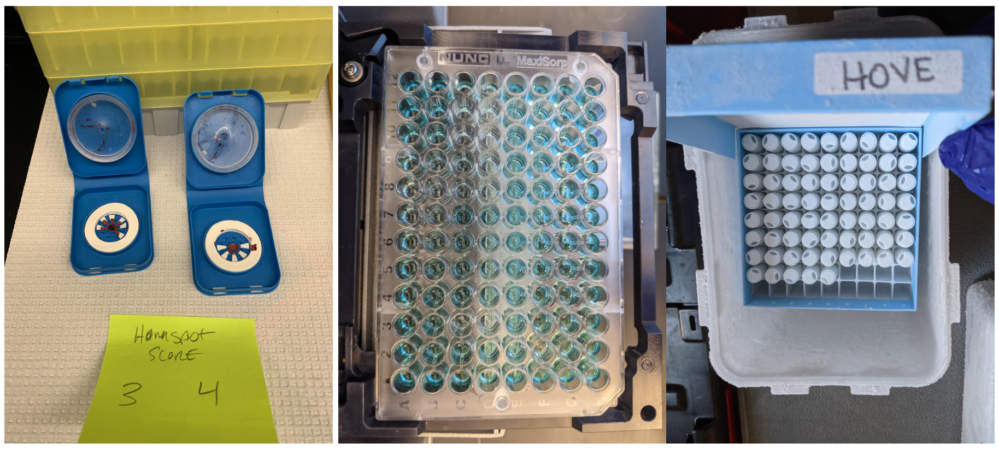

 In my current position as a **research scientist** for the University of Washington's [Center for Studies in Demography and Ecology](https://csde.washington.edu/){target="_blank"}, I've had the opportunity to re-acquaint myself with bench work, train undergraduates, and put my phlebotomist certification to good use.

Current projects involve developing standardization methods for running bioanalytic assays (e.g., single and multiplex ELISAs) on hemaspot dried blood spot samples, running validation assays for various in-house assays (e.g., C-reactive protein) and processing, extracting, and running Cortisol assays on hair samples. 

{width=100%}

