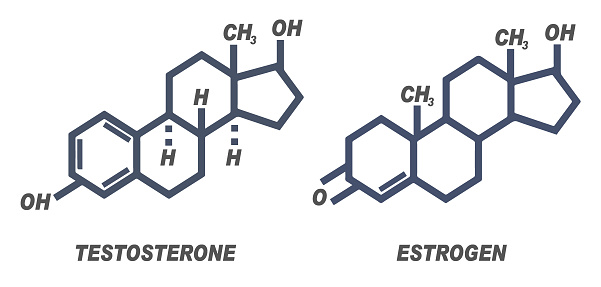

```{r , include=FALSE}
load("Portfolio.RData")
inst = lapply(pkgs, library, character.only = TRUE) 
```

<font size="5"> Estimating the non-linear sex-specific effects of age on estradiol and testosterone levels using [brms](https://cran.r-project.org/web/packages/brms/index.html){target="_blank"} and [mgcv](https://cran.r-project.org/web/packages/mgcv/index.html){target="_blank"} packages </font size="5">

{width=50%}

<font size="4"> I came up with the idea for this fun side project while serving as a mentor for the [UCSB research mentorship program](https://summer.ucsb.edu/programs/research-mentorship-program/overview){target="_blank"}. After chatting with my students about the biological relevance of the questions we were working on, I realized that some students were under the impression that estradiol is *only* produced by females and testosterone is *only* found in males. In addition to showing sex-specific production of both hormones, I also wanted to develop models showcasing how hormone production can vary across the entire lifespan. </font size="4">

### Data importing and cleaning
<font size="4"> The complete **R code** for this project lives [here](https://github.com/carmenhove/portfolio/blob/main/ProjectA.R){target="_blank"}. </font size="4">

<font size="3"> I utilized publicly available data collected by the [National Health and Nutrition Examination Survey (NHANES)](https://www.cdc.gov/nchs/nhanes/about_nhanes.htm){target="_blank"}. By searching through variable names in the [NHANES codebook](https://wwwn.cdc.gov/nchs/nhanes/search/default.aspx){target="_blank"}, I found that both testosterone and estradiol were measured in males and females ages 6 and up during [2013-2014](https://wwwn.cdc.gov/Nchs/Nhanes/2013-2014/TST_H.htm){target="_blank"} and [2015-2016](https://wwwn.cdc.gov/Nchs/Nhanes/2015-2016/TST_I.htm){target="_blank"} collection cycles. I also imported corresponding [demographic](https://wwwn.cdc.gov/nchs/nhanes/2013-2014/demo_h.htm), [BMI](https://wwwn.cdc.gov/Nchs/Nhanes/2013-2014/BMX_H.htm){target="_blank"} and [health data](https://wwwn.cdc.gov/Nchs/Nhanes/2013-2014/RHQ_H.htm){target="_blank"} and merged by SEQN (participant identification number). <font size="3">

```{r}
str(PAdf1)
```

### Checking assumptions of normality

Plotting initial density distributions for estradiol and testosterone indicated unexpectedly large variance. Based on visual inspection of the plots below, it seemed possible that there were excess zero-values. 
```{r, fig.height = 3, fig.width = 6, fig.align = "left",echo=FALSE}
ggplot(PAdf2, aes(x = Value, color = Sex, fill = Sex))+
  geom_histogram(bins = 30, alpha = 0.8)+
  geom_density(alpha=.2)+ 
  facet_grid(~ Measure, scales = "free")+
    scale_color_manual(values = colorset1)+
  scale_fill_manual(values = colorset1)
```

A quick check indicated that there were **no** zero-values for estradiol or testosterone.
```{r}
sum(PAdf2$Value==0,na.rm = T)
```

A closer evaluation of the [NHANES data file](https://wwwn.cdc.gov/Nchs/Nhanes/2013-2014/TST_H.htm){target="_blank"} (screengrab below) indicated that these non-zero but lower-than-expected values were **imputed values** generated for individuals who had assay results below the limit of detection.

{width=65%}

Since these imputed values reflect limits of assay sensitivity rather than biological reality, I removed them from the dataset and then plotted  log-transformed estradiol and testosterone distributions.
```{r, fig.height = 3, fig.width = 6, fig.align = "left",echo=FALSE}
ggplot(PAdf3, aes(x = log(Value), color = Sex, fill = Sex))+
  geom_histogram(bins = 30, alpha = 0.8)+
  facet_grid( ~ Measure,scales = "free")+
    scale_color_manual(values = colorset1)+
  scale_fill_manual(values = colorset1)
```

Considering the well-known effects of pregnancy on hormone production, I also checked to see how many pregnant women were in my sample and how they might be driving "extreme" values. A quick check indicated that there were 112 pregnant females in my sample. For the purpose of this project, I removed pregnant individuals from the final sample.
```{r}
table(PAdf3$Pregnant.Sex)
```
```{r, fig.height = 3, fig.width = 6, fig.align = "left",echo=FALSE}
ggplot(PAdf3, aes(x = Age, y = log(Value), color = Pregnant.Sex))+
  geom_point(position = "jitter")+
  facet_grid(~ Measure, scales = "free")+
  scale_color_manual(values = colorset2)
```

### Sex-specific models
Given the difference in distribution parameters between males and females, I built sex-specific models which allowed for better model fit. For all model evaluation methods described below, I use the "Testosterone.Male" model to generate each example rather than provide the code for all four models ("Testosterone.Female","Estradiol.Male","Estradiol.Female"). 

### Justifying use of nonlinear regression
A visual examination of the plot below clearly shows that the effects of age on estradiol and testosterone are non-linear in both sexes. 
```{r, fig.height = 3, fig.width = 6, fig.align = "left",echo=FALSE}
ggplot(PAdf4, aes(x = Age, y = log(Value), 
                  color = Sex))+
  geom_point(position = "jitter")+
  facet_grid(~ Measure, scales = "free")+
  scale_color_manual(values = colorset2)
```

To confirm this statistically, I used an ANOVA test to compare linear (glm) versus nonlinear (gam) models. As clearly shown in the example ANOVA test below, nonlinear regression was warranted. 
```{r, echo=FALSE}
anova(glm.models[["Testosterone.Male"]],
      gam.models[["Testosterone.Male"]],test="Chisq")
```

### Frequentist nonlinear regression using mgcv

Below is a plot of gam predicted mean values for testosterone and estradiol, clearly showing the sex-specific non-linear effects of age on hormone production.
```{r, fig.height = 3, fig.width = 6, fig.align = "left",echo=FALSE}
ggplot(gam.predvals, aes(x = Age, y = lnValue, 
                           color = Sex, fill = Sex)) + 
  geom_line(size = 0.7)+
  geom_ribbon(aes(ymin = lnValue - se.fit, 
                  ymax = lnValue + se.fit, 
                  group = Sex),
              alpha=0.6, linetype = 0) +
  facet_grid(~ Measure,scales = "free")+
  scale_color_manual(values = colorset1)+
    scale_fill_manual(values = colorset1)
```

### Bayesian nonlinear regression using brms
I also ran the same models using [brms](https://cran.r-project.org/web/packages/brms/vignettes/brms_overview.pdf){target="_blank"} in order to compare predicted values between frequentist and Bayesian nonlinear regression models. 
When evaluating a Bayesian model, two components need to be checked: the simulation (Markov chain Monte Carlo, in the case of brms models) and the posterior fit. To this end, I checked the Rhat values and caterpillar plots for each model to make sure the chains converged. As with the gam models above, I used the "Testosterone.Male" model to exemplify the process of checking simulation convergence and posterior fit. 

#### Checking the simulation

All Rhat values equal 1, indicating proper chain convergence. *The warning message that there were 3 divergent transitions after warmup is [not cause for concern](https://mc-stan.org/misc/warnings.html#divergent-transitions-after-warmup), since this is a tiny number relative to the number of samples taken and our Rhat values equal 1.*
```{r}
summary(brms.models[["Testosterone.Male"]])
```

Caterpillar plots (on right-hand panel) show excellent mixing between chains.
```{r, fig.height = 6, fig.width = 5, fig.align = "left"}
plot(brms.models[["Testosterone.Male"]])
```

This plot shows the model predicted values (y) graphed over 10 draws from the data (y rep), indicating good posterior fit. 
```{r, fig.height = 3, fig.width = 3, fig.align = "left"}
pp_check(brms.models[["Testosterone.Male"]])
```

#### Graphing posterior predicted values
The plot below shows the predicted mean values, standardized by median BMI.
```{r, fig.height = 3, fig.width = 6, fig.align = "left",echo=FALSE}
ggplot(brms.predvals, aes(x = Age, y = lnValue, 
                          color =Sex, fill = Sex))+
  geom_line(size = 0.7)+
  geom_ribbon(aes(ymin = Q2.5, ymax =Q97.5, group = Sex),
              alpha=0.6, linetype = 0) +
  facet_grid(~Measure,scales = "free")+
  scale_color_manual(values = colorset1)+
    scale_fill_manual(values = colorset1)
```

</font size="3">