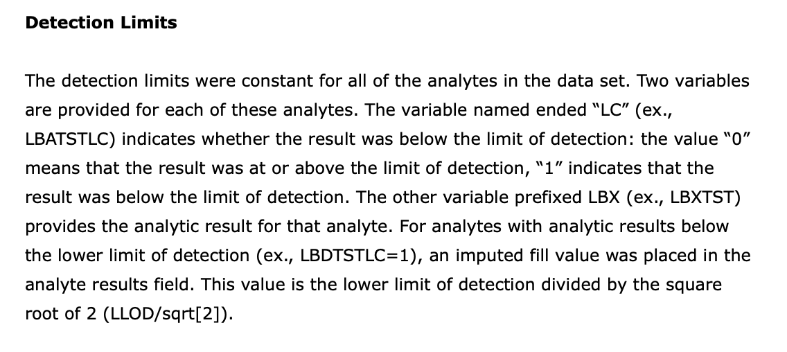

```{r , include=FALSE}
load("Portfolio.RData")
inst = lapply(pkgs, library, character.only = TRUE) 
```
## How does age affect hormone production?

<font size="5"> Estimating the non-linear sex-specific effects of age on estradiol and testosterone levels using [brms](https://cran.r-project.org/web/packages/brms/index.html) and [mgcv](https://cran.r-project.org/web/packages/mgcv/index.html) packages </font size="5">

{width=100%}

<font size="4"> I came up with the idea for this project while serving as a mentor for the [UCSB research mentorship program](https://summer.ucsb.edu/programs/research-mentorship-program/overview). After chatting with my students about the biological relevance of the questions we were working on, I realized that some students were under the impression that estradiol is *only* produced by females and testosterone is *only* found in males. In addition to showing sex-specific production of both hormones, I also wanted to develop models showcasing how hormone production can vary across the entire lifespan. </font size="4">

### Data importing and cleaning
<font size="4"> The complete **R code** for this project lives [here](https://github.com/carmenhove/portfolio/blob/main/Hormones.R). </font size="4">

<font size="3"> I utilized publicly available data collected by the [National Health and Nutrition Examination Survey (NHANES)](https://www.cdc.gov/nchs/nhanes/about_nhanes.htm). By searching through variable names in the [NHANES codebook](https://wwwn.cdc.gov/nchs/nhanes/search/default.aspx), I found that both testosterone and estradiol were measured in males and females ages 6 and up during [2013-2014](https://wwwn.cdc.gov/Nchs/Nhanes/2013-2014/TST_H.htm) and [2015-2016](https://wwwn.cdc.gov/Nchs/Nhanes/2015-2016/TST_I.htm) collection cycles. I also imported corresponding [demographic](https://wwwn.cdc.gov/nchs/nhanes/2013-2014/demo_h.htm), [BMI](https://wwwn.cdc.gov/Nchs/Nhanes/2013-2014/BMX_H.htm) and [health data](https://wwwn.cdc.gov/Nchs/Nhanes/2013-2014/RHQ_H.htm) and merged by SEQN (participant identification number). <font size="3">

```{r}
str(PAdf1)
```

### Checking assumptions of normality

Plotting initial density distributions for estradiol and testosterone indicated unexpectedly large variance. Based on visual inspection of the plots below, it seemed possible that there were excess zero-values. However, a quick check indicated that there were no zero-values for estradiol or testosterone.
```{r, fig.height = 3, fig.width = 6, fig.align = "left",echo=FALSE}
ggplot(PAdf2, aes(x = Value, color = Sex, fill = Sex))+
  geom_histogram(bins = 30, alpha = 0.8)+
  geom_density(alpha=.2)+ 
  facet_grid(~ Measure, scales = "free")+
    scale_color_manual(values = colorset1)+
  scale_fill_manual(values = colorset1)
```
```{r}
sum(PAdf2$Value==0,na.rm = T)
```

A closer evaluation of the [NHANES data file](https://wwwn.cdc.gov/Nchs/Nhanes/2013-2014/TST_H.htm) (screengrab below) indicated that these non-zero but lower-than-expected values were **imputed values** generated for individuals who had assay results below the limit of detection.

{width=65%}

Since these imputed values reflect limits of assay sensitivity rather than biological reality, I removed them from the dataset and then plotted  log-transformed estradiol and testosterone distributions.
```{r, fig.height = 3, fig.width = 6, fig.align = "left",echo=FALSE}
ggplot(PAdf3, aes(x = log(Value), color = Sex, fill = Sex))+
  geom_histogram(bins = 30, alpha = 0.8)+
  facet_grid( ~ Measure,scales = "free")+
    scale_color_manual(values = colorset1)+
  scale_fill_manual(values = colorset1)
```

Another consideration is how pregnancy status among females may impact hormone levels, since biological knowledge suggests that estradiol is likely to be much higher during pregnancy. A quick check indicated that there were 112 pregnant females in this sample. 
```{r}
table(PAdf3$Pregnant.Sex)
```

Lastly, I broke my sample into age groups roughly lined up with female reproductive phase (e.g., pre-menarche, reproductive, post-menopausal)
```{r, fig.height = 3, fig.width = 6, fig.align = "left",echo=FALSE}
ggplot(PAdf3 %>% filter(Measure == "Testosterone"), 
        aes(x = log(Value), color = Sex, fill = Sex))+
     geom_density(alpha = 0.5)+ 
     facet_grid(~ Sex, scales = "free")+
     scale_color_manual(values = colorset1)+
     scale_fill_manual(values = colorset1)
```

The plot below gives an idea of how pregnancy status corresponds to "extreme" values, especially for estradiol.  
```{r, fig.height = 3, fig.width = 6, fig.align = "left",echo=FALSE}
ggplot(PAdf3, aes(x = Age, y = log(Value), color = Pregnant.Sex))+
  geom_point(position = "jitter")+
  facet_grid(~ Measure, scales = "free")+
  scale_color_manual(values = colorset2)
```

### Justifying use of nonlinear regression
A visual examination of the plot above clearly shows that the effects of age on estradiol and testosterone are non-linear in both sexes. As an example of how this plays outstatistically, I modeled log Testosterone ~ Age + BMI (in males only) using both glm() and gam() and used an anova test to compare these two models. As clearly shown in the anova test, the nonlinear regression is more appropriate.
```{r, echo=FALSE}
anova(glm.models[["Testosterone.Male"]],
      gam.models[["Testosterone.Male"]],test="Chisq")
```

### Frequentist nonlinear regression using gam()

```{r, fig.height = 3, fig.width = 6, fig.align = "left",echo=FALSE}
ggplot(gam.predvals, aes(x = Age, y = lnValue, 
                           color = Sex, fill = Sex)) + 
  geom_line(size = 0.7)+
  #geom_point(data = PAdf3, aes(x = Age, y = log(Value),
  #                             color = Sex), 
  #           position = "jitter", alpha = 0.3)+
  geom_ribbon(aes(ymin = lnValue - se.fit, 
                  ymax = lnValue + se.fit, 
                  group = Sex),
              alpha=0.6, linetype = 0) +
  facet_grid(~ Measure,scales = "free")+
  scale_color_manual(values = colorset1)+
    scale_fill_manual(values = colorset1)
```

### Fully Bayesian models using brms()
summary = rhat, effective sample size, estimate and credible intervals
Simulation check (Caterpillar plots)
Posterior fit check
Point estimates

```{r}

```

```{r, fig.height = 3, fig.width = 6, fig.align = "left",echo=FALSE}

ggplot(brms.predvals, aes(x = Age, y = lnValue, 
                          color =Sex, fill = Sex))+
  #geom_point(data = PAdf3, aes(x = Age, y = log(Value),
  #                             color = Sex),
  #           position = "jitter", alpha = 0.3)+
  geom_line(size = 0.7)+
  geom_ribbon(aes(ymin = Q2.5, ymax =Q97.5, group = Sex),
              alpha=0.6, linetype = 0) +
  facet_grid(~Measure,scales = "free")+
  scale_color_manual(values = colorset1)+
    scale_fill_manual(values = colorset1)
```


### Comparing methods
Compare running times (gam much faster)
Compare point estimates (credible intervals versus confidence intervals)
Large dataset, so priors are basically washed out in brms model


</font size="3">