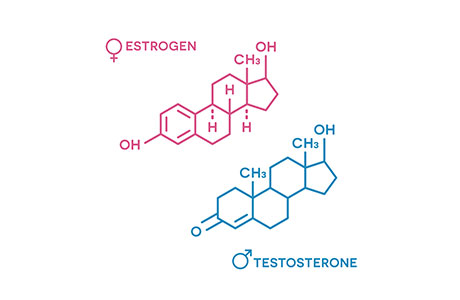

```{r , include=FALSE}
load("Portfolio.RData")
inst = lapply(pkgs, library, character.only = TRUE) 
```

## What are the sex-specific effects of age on hormone production?

<font size="5"> Estrogen and testosterone are often described as female and male hormones, respectively, but both sexes produce each hormone (just at different concentrations).</font size="5">

{width=50%}

<font size="4"> In this for-fun project, I utilize publicly available data collected by the [National Health and Nutrition Examination Survey (NHANES)](https://wwwn.cdc.gov/Nchs/Nhanes/2015-2016/TST_I.htm#Component_Description) to model the sex-specific effects of age on estradiol and testosterone.</font size="4">

Testosterone (LBXTST) and Estradiol (LBXEST) measured in both males and females ages 6 and up during 2014-2015 and 2015-2016 collection cycles. Testosterone as ng/dL, estradiol was pg/mL. Detection limit data also collected as a comment code, indicating whether or not detection limit threshold was met.

```{r tables-dataset}
knitr::kable(dataset[1:5, ], caption = 'A caption')
```