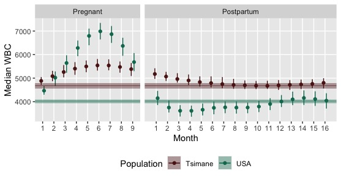
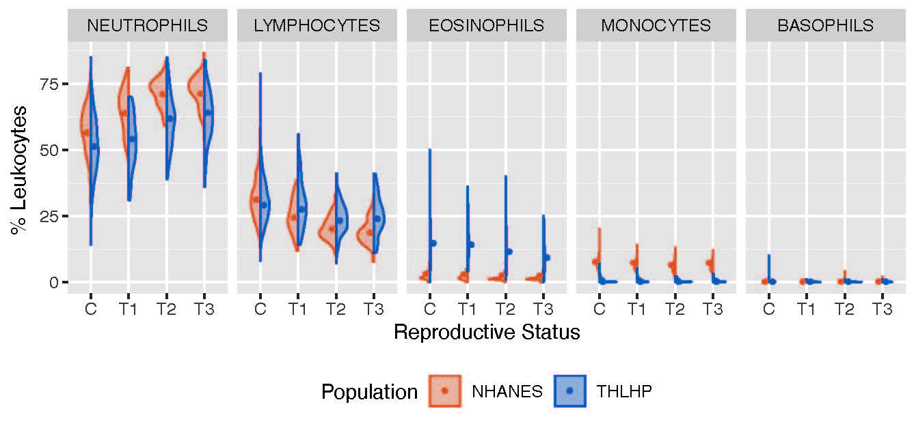

```{r setup, include=FALSE}
knitr::opts_chunk$set(echo = TRUE)
```

### Bayesian hierarchical nonlinear regression 
<font size="4">

1. **Do postpartum women exhibit unique immune profiles? If so, how does maternal immune status in the postpartum period compare to markers of immune function during pregnancy?** <br /> For this project, I combined immunological data from regularly cycling, pregnant, and postpartum [Tsimane](https://en.wikipedia.org/wiki/Tsiman%C3%A9){target="_blank"} and USA women and modelled the effects of month of pregnancy and month since delivery on leukocyte differential, C-reactive protein concentration, and neutrophil-to-lymphocyte ratio. Below is a graph showing estimated median white blood cell count (and 95% credible intervals) by month of pregnancy and month since delivery among Tsimane and USA women. Banded lines indicate population-specific cycling baseline values. <font size="3">*Manuscript in prep.* <br />
{width=50%}

2. <font size="4"> **Does the degree of sexual dimorphism in immune function vary across populations as a function of divergent ecological conditions (e.g., pathogen burden, reduced energetic reserves)?** <br />  For this paper, I utilized data from the [Tsimane Health and Life History Project](https://tsimane.anth.ucsb.edu/){target="_blank"} and [NHANES](https://www.cdc.gov/nchs/nhanes/index.htm){target="_blank"} and Bayesian nonlinear hierarchical regression models to estimate the population-specific effects of age on immune function, stratified by sex and female reproductive phase. Below is a graph showing estimated median natural-logged white blood cell count (and 95% credible intervals) by age, sex, and female reproductive phase among individuals in the USA. <font size="3"> *Manuscript in prep.* <br />

{width=50%}


3. <font size="4"> **How do predicted values vary between models specified using brms versus mgcv?** <br /> This was a fun side project, where I modeled the non-linear sex-specific effects of age on estradiol and testosterone levels using [brms](https://cran.r-project.org/web/packages/brms/index.html){target="_blank"} and [mgcv](https://cran.r-project.org/web/packages/mgcv/index.html){target="_blank"} packages and compared the predicted values. Below is a plot showing the mgcv predicted median values and 95% credible intervals for estradiol and testosterone among males and females by age. Click [here](ProjectA.html){target="_blank"} for the corresponding write-up and R code. <br />
{width=55%}

### Bayesian hierarchical linear regression
1. <font size="4"> **Do peripheral markers of fetal tolerance vary across populations experiencing different environmental conditions?** <br /> For this paper, I utilized fully Bayesian hierarchical regression models to estimate and comparing the effects of trimester of pregnancy on immune status among Tsimane and USA women. Figure below shows the predicted percentage of each leukocyte subset among cycling (C) and first (T1), second (T2), and third (T3) trimester Tsimane and USA women. <font size="3"> *Results published in [here](https://academic.oup.com/emph/article/2020/1/114/5866980){target="_blank"}*. <br />
<br /> 
{width=55%}

### Modelling probability
1. <font size="4"> **Does sex bias in COVID-19 mortality differ between high-income and low-income countries?**  <br /> During summer 2021, I worked with my [Research Mentorship Program](https://summer.ucsb.edu/programs/research-mentorship-program/overview){target="_blank"} student Delaney Nystrom to pull publicly available data from the [Sex, Gender and COVID-19 project](https://globalhealth5050.org/the-sex-gender-and-covid-19-project/){target="_blank"} to determine if/how sex bias in COVID-19 mortality varied by country using binomial classification models. Below is a graph showing predicted probability of male (versus female) death due to COVID-19 in four high-income countries (Australia, Spain, Sweden, Switzerland) and three low-income countries (Kenya, Nigeria, Zimbabwe). <br />
{width=45%}

### Classification using Machine Learning algorithms
1. <font size="4"> **How well do different ML algorithms predict precipitation in Seattle, WA (my hometown)?**  <br /> This was a for-fun side project, where I used logistic regression, Naïve Bayes, and *k*-Nearest neighbors to predict precipitation in Seattle. Please click [here](ProjectB.html){target="_blank"} for full write-up and R code. Plot below shows the predictive accuracy of my *k*-Nearest neighbors model by specified K-value. <br />
{width=40%}

