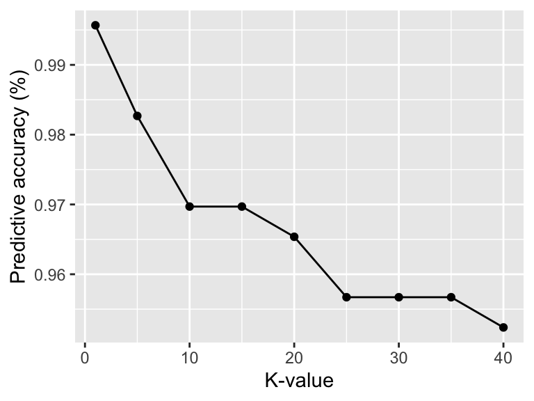

```{r setup, include=FALSE}
knitr::opts_chunk$set(echo = TRUE)
```


<font size="4"> **Does breastfeeding behavior correspond to differences in perceived physical and mental wellbeing among postpartum women?** <br /> <font size="3"> Using survey data I collected for the [Seattle Postpartum Health Study](Studies.html){target="_blank"}, I employed linear Bayesian regression models to estimate the association between infant feeding behavior (at-the-nipple breastfeeding, use of expressed/pumped breastmilk) and reported mental (EPDS score) and physical (PHQ) health. To parse out potential effects of time since delivery, I also ran separate models using early versus late postpartum as an interaction term (<70 DSD = less than 70 days since delivery, >70 DSD = more than days since delivery). Plot A shows that ATN breastfeeding is reliably associated with fewer symptoms of depression, while effects of pumping vary by time since delivery. Plot B shows that pumping is associated with more symptoms of physical illness, regardless of time since delivery. 
 <font size="3">*Manuscript in prep.* <br />
{width=60%}


<font size="4"> **Does the degree of sexual dimorphism in immune function vary across populations as a function of divergent ecological conditions (e.g., pathogen burden, reduced energetic reserves)?** <br />  <font size="3"> For this paper, I utilized data from the [Tsimane Health and Life History Project](https://tsimane.anth.ucsb.edu/){target="_blank"} and [NHANES](https://www.cdc.gov/nchs/nhanes/index.htm){target="_blank"} and Bayesian nonlinear hierarchical regression models to estimate the population-specific effects of age on immune function, stratified by sex and female reproductive phase. Below is a graph showing estimated median natural-logged white blood cell count (and 95% credible intervals) by age, sex, and female reproductive phase among individuals in the USA. <font size="3"> *Manuscript in prep.* <br />

{width=50%}

<font size="4"> **How do predicted values vary between models specified using brms versus mgcv?** <br /> <font size="3"> This was a fun side project, where I modeled the non-linear sex-specific effects of age on estradiol and testosterone levels using [brms](https://cran.r-project.org/web/packages/brms/index.html){target="_blank"} and [mgcv](https://cran.r-project.org/web/packages/mgcv/index.html){target="_blank"} packages and compared the predicted values. Below is a plot showing the mgcv predicted median values and 95% credible intervals for estradiol and testosterone among males and females by age. Click [here](ProjectA.html){target="_blank"} for the corresponding write-up and R code. <br />
{width=55%}

<font size="4"> **Does sex bias in COVID-19 mortality differ between high-income and low-income countries?**  <br /> <font size="3">  During summer 2021, I worked with my [Research Mentorship Program](https://summer.ucsb.edu/programs/research-mentorship-program/overview){target="_blank"} student Delaney Nystrom to pull publicly available data from the [Sex, Gender and COVID-19 project](https://globalhealth5050.org/the-sex-gender-and-covid-19-project/){target="_blank"} to determine if/how sex bias in COVID-19 mortality varied by country using binomial classification models. Below is a graph showing predicted probability of male (versus female) death due to COVID-19 in four high-income countries (Australia, Spain, Sweden, Switzerland) and three low-income countries (Kenya, Nigeria, Zimbabwe). <br />
{width=45%}

<font size="4"> **How well do different Machine Learning algorithms predict precipitation in Seattle?**  <br /> <font size="3"> This was a for-fun side project, where I used logistic regression, Naïve Bayes, and *k*-Nearest neighbors to predict precipitation in Seattle. Please click [here](ProjectB.html){target="_blank"} for full write-up and R code. Plot below shows the predictive accuracy of my *k*-Nearest neighbors model by specified K-value. <br />
{width=40%}

