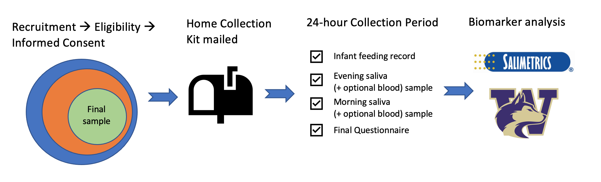
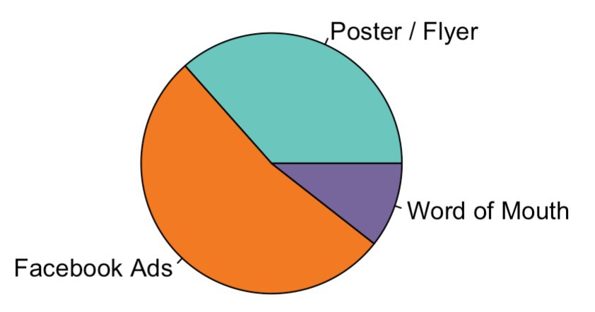

```{r setup, include=FALSE}
knitr::opts_chunk$set(echo = TRUE)
```

<font size="5"> A case study on research design and survey development

### Research Question

<font size="4">

The Seattle Postpartum Health Study was designed to evaluate two overarching questions. First, does variation in infant feeding behavior (e.g., breastfeeding, pumping) affect maternal immune status and perceived mental / physical health? Second, does time-since-delivery moderate these effects as a result of shifting maternal optimums?

{width=100%}

### Study Design 
<font size="4"> 
I designed the original protocol for the Seattle Postpartum Health Study before SARS-CoV-2 reached the United States. It was going to be a beautiful, longitudinal, in-person study and I was going to collect full blood-draws (which is the gold standard). A week after obtaining original IRB approval and NSF DRIG funding, in-person research was shut down. **I quickly pivoted to a new approach** that allowed participants to complete the entire study from home within a single 24-hour period (which allowed for a condensed 2-point sampling plan). My revised IRB proposal was approved and I successfully obtained additional funding from the Wenner-Gren Foundation. 

Open recruitment for this research project began in September 2020, with active data collection continuing through July 2021. **During this time, 96 mothers (goal n = 100) completed the study**. Of the 96 participants who completing the study, 95 successfully collected both bedtime and waking saliva samples and 88 individuals opted into dried blood spot collection, resulting in 190 total saliva samples and 176 total dried blood spot samples. Saliva samples were shipped over night on dry ice to the Salimetrics lab, where they were analyzed for inflammatory markers. Dried blood spots are currently being analyzed in-house at the [University of Washington](Bioanalytics.html){target="_blank"}. 

{width=100%}

### Recruitment Overview
 

<font size="4"> We used publicly available data on household demographics for the Seattle metro area to determine where to focus recruitment efforts (i.e., areas with highest reported concentrations of young children/new parents). [Recruitment materials](Hard-copy-recruitment-copy.html){target="_blank"} were strategically distributed across the city and logged using an interactive map. We also created Facebook ads aimed at our target demographic. Below is a plot breaking down how our participants were recruited. 

{width=35%}

### Take the surveys

 

Complete the following surveys as if you were an actual participant, using the following information.

<font size="3">

1. Your name is Iwanna Doscience
2. Your PID is 011
3. Your email is iwanna@ucsb.edu
4. Your phone number is (805) 111-2222 
5. Your address is 200 2nd Ave N, Seattle, WA 98109

<font size="3"/>

In order to be coded as eligible, Iwanna needs to meet the following criteria:

<font size="3">

1. Between ages 18 and 45
2. Currently residing in King County
3. Gave birth within the last 6 months
4. Did NOT give birth more than 4 weeks before due date
5. NO history of malignancy/cancer
6. NO history of periodontal disease
7. NO use of tobacco products

<font size="3/">

<font size="4">

&#8594; Take the [eligibility survey, access the online consent form, and schedule a collection date](https://ucsbltsc.qualtrics.com/jfe/form/SV_3q2dlt5ytZbhV1Y){target="_blank"}. 

&#8594; Now use Iwanna's completed [Collection Instruction Form](CIF_example.html){target="_blank"} to take the [Final Questionnaire](https://ucsbltsc.qualtrics.com/jfe/form/SV_8jFawK6yj0wpmAu){target="_blank"}. 


