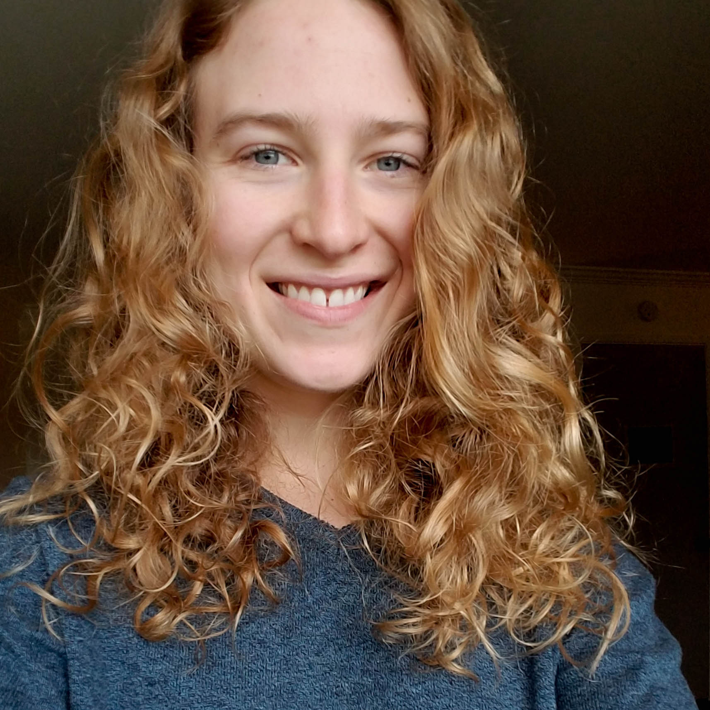

 Hello, thanks for being here.  
 

## Start early

Start early, work gradually. Build up an outline for general topics and each of your specialization topics (which you should clear with your advisor beforehand). Add relevant info that you may glean from papers/books/lectures/conferences. Keep an organized notebook dedicated to comps. 

## Use concept maps

For each topic of study, generate a concept map. Check out Carmen's [blog](https://theinformalscientist.com/concept-maps-and-the-path-to-deep-learning/) on this topic and watch this [Youtube video](https://www.youtube.com/watch?v=8XGQGhli0I0). 

### 
{width=30%}

## Sort PDFs and citations

Keeping PDFs and citations organized, accessible, and tabulated is key. Use [Mendeley](https://www.mendeley.com) or other PDF organizer to sort papers and citations. Install a citation plug-in inside Word, so inserting citations while writing the exam will be fast and easy. 

Website last updated: `r Sys.Date()`.
