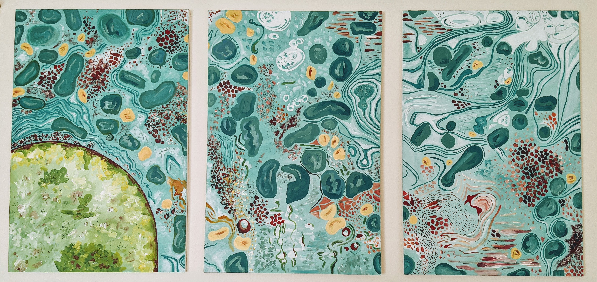

```{r setup, include=FALSE}
knitr::opts_chunk$set(echo = FALSE)
library("xfun")
library(xfun)
```


### Hi, I'm Carmen and I'm a quantitative research scientist
<font size="4"> I hold a BS in biology, a PhD in Physical & Biological Anthropology, and have over 7 years of end-to-end research experience.  

### CV / Resume

```{r}
xfun::embed_file("Hove_Application.pdf")
```

### Contact
Email: hove.cm@gmail.com | 
[LinkedIn](https://www.linkedin.com/in/carmenhove/) | [Github](https://github.com/carmenhove) | [Twitter](https://twitter.com/CarmenHove)
</font size="4">

{width=100%}
<font size="2.5"> <figcaption align = "center"> Hepatocyte (triptych oil on canvas), by Alexa Carr </figcaption></font size="2.5">

<font size="2"> Website last updated: `r Sys.Date()`.

