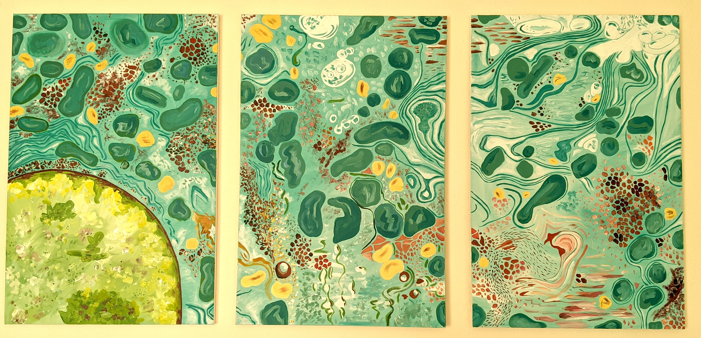

### Hi, my name is Carmen and I'm a **quantitative research scientist**

 With an undergraduate degree in biology, a PhD in Biological Anthropology, and over 7 years of experience analyzing complex real-world datasets, my quantitative research skills are built on firm understanding of biological mechanisms and evolutionary context. I have experience leveraging a variety of analytic methods, including linear and logistic regression, nonparametric regression, Bayesian hierarchical/multilevel models, Naive Bayes classification, and *k*-Nearest Neighbors cluster analysis. I'm passionate about learning and continually seaking opportunities to expand my analytical toolset. 

**This portfolio**: Due to confidentiality considerations, I haven't included any analyses for pending manuscripts in this portfolio. You *will* find relevant side projects under [Project A]() and [Project B](), as well as links to peer-reviewed papers I have co-authored under [Publications]().If you'd like to get in touch, please don't hesitate to send me a message using the info below!

*Email:* hove.cm@gmail.com | *LinkedIn:* [linkedin.com/in/carmenhove/](https://www.linkedin.com/in/carmenhove/) | *GitHub:* [github.com/carmenhove](https://github.com/carmenhove)*

{width=100%}

<figcaption align = "center"> Hepatocyte (triptych oil on canvas), by Alexa Carr </figcaption>

 Website last updated: `r Sys.Date()`.

